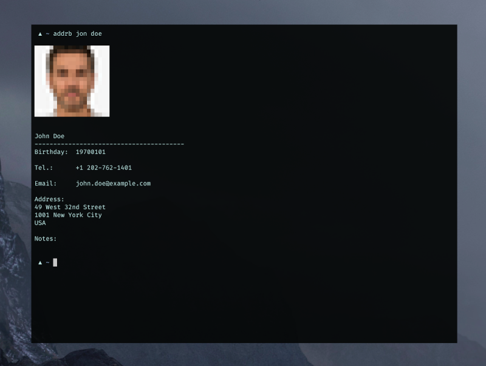

addrb
-----



`addrb`, the command line **addr**ess **b**ook.

## Build

```sh
go build .
```

## Run

Either export all necessary variables to your ENV or set them as command line
flags:

```sh
export CARDDAV_USERNAME='...'
export CARDDAV_PASSWORD='...'
export CARDDAV_ENDPOINT='...'
export ADDRB_DB='...'
```

If you're using [Baïkal](https://github.com/sabre-io/Baikal) for example, you
would export something like this as `CARDDAV_ENDPOINT`:

```sh
export CARDDAV_ENDPOINT='https://my.baik.al/dav.php/'
```

The `ADDRB_DB` is the local contacts database in order to not need to contact
the CardDAV for every lookup. You might set it to something like this:

```sh
export ADDRB_DB=~/.cache/addrb.db
```

When `addrb` is launched for the first time, it requires the `-r` flag to
refresh the contacts and sync them locally: 

```sh
addrb -r john doe
```

This command will connect to the CardDAV server, sync all address books/contacts
locally and perform a lookup for *john doe*. It will display you the contact(s) 
if any was found.

Find more flags and info with `addrb --help`.

## FAQ

- Q: Does `addrb` write/modify any contact information?
  A: Nope, so far it's read-only and does not support updating vCards.
- Q: Can I use it with my local address book?
  A: Nope, as of right now `addrb` only supports CardDAV servers to sync with.
- Q: Does it support HTTP Digest auth?
  A: Nope, only HTTP Basic auth.

